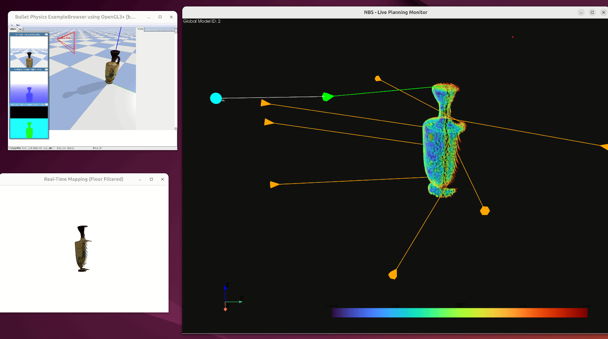
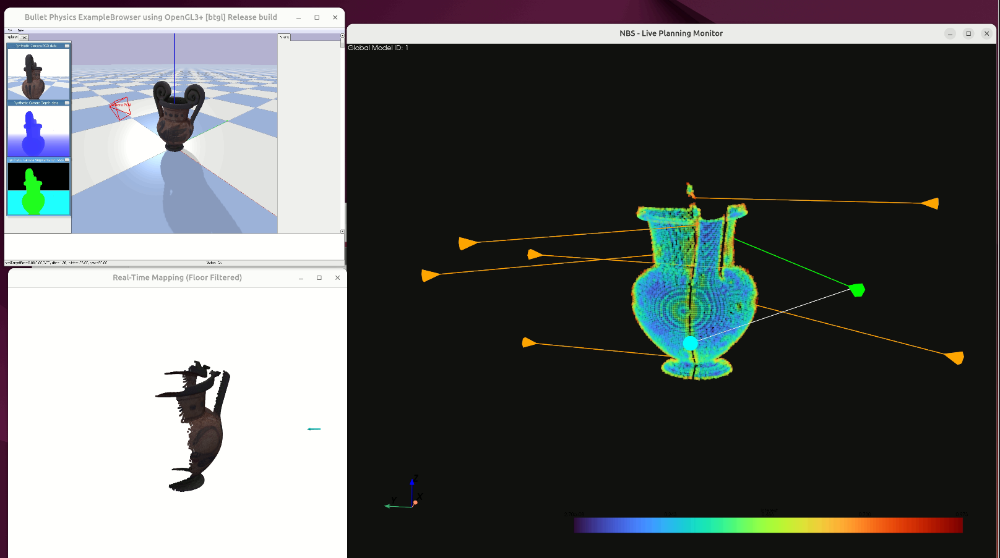
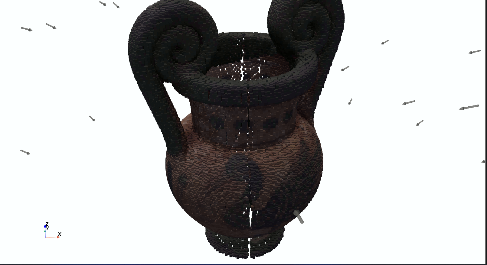

# Next Best View Algorithm : HERCULES I

Implementation of a next-best-view camera positioning algorithm, developed in the PyBullet environment and utilizing the PyVista library.


 <div style="text-align:center;">
    
</div>

We create a folder and set up a Python virtual environment using the command:

```
python3 -m venv venv
```

You activate the virtual environment using the command:
```
source venv/bin/activate
```
We install the necessary libraries.

 And we open three parallel terminals. In each one, we run:

* In the 1st terminal, we type:

```
python3 world2.py
```

* In the 2nd terminal, we type:

```
python3 view_scanner_only_obj.py
```
* In the 3rd terminal, we type:

```
python3 edit_global_control.py
```

And once the three windows open, we press the `space key` to start the algorithm.

 <div style="text-align:center;">
    
</div>

<div style="text-align:center;">
    
</div>
